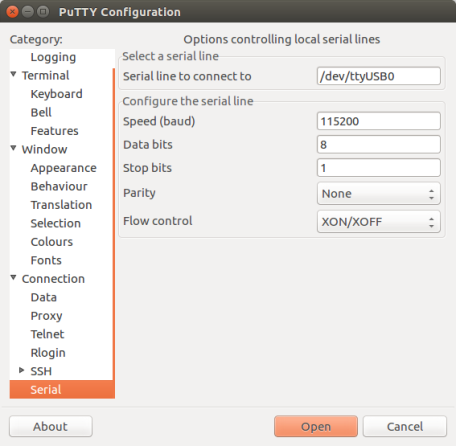

## Overview

This tutorial contains instructions for the following getting started steps:

* Connecting your board to a host machine.
* Installing software on the host machine for developing and debugging embedded applications for your microcontroller board.
* Cross compiling a FreeRTOS demo application to a binary image.
* Loading the application binary image to your board, and then running the application.
* Interacting with the application running on your board across a serial connection for monitoring purposes.


## Prerequisites

Before you get started with FreeRTOS on your MiniHub Pro board, you need to set up your AWS account and permissions.

To create an AWS account, see [Create and Activate an AWS Account](https://aws.amazon.com/premiumsupport/knowledge-center/create-and-activate-aws-account/).

To add an IAM user to your AWS account, see IAM User Guide. To grant your IAM user account access to AWS IoT and FreeRTOS, attach the following IAM policies to your IAM user account:

* `AmazonFreeRTOSFullAccess`
* `AWSIoTFullAccess`

To attach the AmazonFreeRTOSFullAccess policy to your IAM user

1. Browse to the [IAM console](https://console.aws.amazon.com/iam/home), and from the navigation pane, choose **Users**.
2. Enter your user name in the search text box, and then choose it from the list.
3. Choose **Add permissions**.
4. Choose **Attach existing policies directly**.
5. In the search box, enter `AmazonFreeRTOSFullAccess`, choose it from the list, and then choose **Next: Review**.
6. Choose **Add permissions**.

To attach the AWSIoTFullAccess policy to your IAM user

1. Browse to the [IAM console](https://console.aws.amazon.com/iam/home), and from the navigation pane, choose **Users**.
2. Enter your user name in the search text box, and then choose it from the list.
3. Choose **Add permissions**.
4. Choose **Attach existing policies directly**.
5. In the search box, enter `AWSIoTFullAccess`, choose it from the list, and then choose **Next: Review**.
6. Choose **Add permissions**.

For more information about IAM and user accounts, see [IAM User Guide](https://docs.aws.amazon.com/IAM/latest/UserGuide/).

For more information about policies, see [IAM Permissions and Policies](https://docs.aws.amazon.com/IAM/latest/UserGuide/introduction_access-management.html).


## Set Up the MiniHub Pro Hardware

* Browan MiniHub Pro


* USB Type C Breakout Board adapter


The Wiring Diagram for development:

	[MiniHub Pro]===[adapter]===usb-type-C===[Linux machine]


**Note**: You must use the adapter board provided by Browan to erase the flash or upgrade the firmware.

Please pay attention to the direction. The label of the Type-C breakout board is aligned with the word RESET.


## Set Up Your Development Environment

To communicate with your board, you need to download and install a toolchain.


### Setting Up the Toolchain

To set up the toolchain, follow the instructions for your Linux operating system:

**Note:** Version 3.3 of the ESP-IDF (the version used by FreeRTOS) does not support the latest version of the ESP32 compiler. You must use the compiler that is compatible with version `3.3` of the ESP-IDF (see the [links](https://docs.espressif.com/projects/esp-idf/en/v3.3/get-started-cmake/linux-setup.html)). To check the version of your compiler, run "xtensa-esp32-elf-gcc --version".


#### Install Prerequisites

To build firmware for MiniHub Pro hardware, we need the ESP-IDF framework in the Amazon FreeRTOS SDK. ESP-IDF is a framework based on the ESP32 compiler and build tools. To compile with ESP-IDF you need to get the following packages:

* Ubuntu and Debian:

	sudo apt-get install git wget libncurses-dev flex bison gperf python python-pip python-setuptools python-serial python-cryptography python-future python-pyparsing cmake ninja-build ccache

* CentOS 7:

	sudo yum install git wget ncurses-devel flex bison gperf python pyserial cmake ninja-build ccache


#### Toolchain Setup

MiniHub Pro toolchain for Linux is available for download from Espressif website:

for 64-bit Linux:

* https://dl.espressif.com/dl/xtensa-esp32-elf-linux64-1.22.0-80-g6c4433a-5.2.0.tar.gz

for 32-bit Linux:

* https://dl.espressif.com/dl/xtensa-esp32-elf-linux32-1.22.0-80-g6c4433a-5.2.0.tar.gz


1.Download this file, then extract it in `~/esp` directory:

for 64-bit Linux:

	mkdir -p ~/esp
	cd ~/esp
	tar -xzf ~/Downloads/xtensa-esp32-elf-linux64-1.22.0-80-g6c4433a-5.2.0.tar.gz

for 32-bit Linux:

	mkdir -p ~/esp
	cd ~/esp
	tar -xzf ~/Downloads/xtensa-esp32-elf-linux32-1.22.0-80-g6c4433a-5.2.0.tar.gz


2.The toolchain will be extracted into `~/esp/xtensa-esp32-elf/` directory.

To use it, you will need to update your `PATH` environment variable in `~/.profile` file. To make `xtensa-esp32-elf` available for all terminal sessions, add the following line to your `~/.profile` file:

	export PATH="$HOME/esp/xtensa-esp32-elf/bin:$PATH"

Alternatively, you may create an alias for the above command. This way you can get the toolchain only when you need it. To do this, add different line to your `~/.profile` file:

	alias get_esp32='export PATH="$HOME/esp/xtensa-esp32-elf/bin:$PATH"'

Then when you need the toolchain you can type `get_esp32` on the command line and the toolchain will be added to your `PATH`.

**Note:** If you have `/bin/bash` set as login shell, and both `.bash_profile` and `.profile` exist, then update `.bash_profile` instead.


3.Log off and log in back to make the `.profile` changes effective. Run the following command to verify if `PATH` is correctly set:

	printenv PATH

You are looking for similar result containing toolchain’s path at the beginning of displayed string:

	$ printenv PATH
	/home/user-name/esp/xtensa-esp32-elf/bin:/home/user-name/bin:/home/user-name/.local/bin:/usr/local/sbin:/usr/local/bin:/usr/sbin:/usr/bin:/sbin:/bin:/usr/games:/usr/local/games:/snap/bin

Instead of `/home/user-name` there should be a home path specific to your installation.


#### Permission issues /dev/ttyUSB0

With some Linux distributions you may get the `Failed to open port /dev/ttyUSB0` error message when flashing the MiniHub Pro. This can be solved by adding the current user to the dialout group.

	sudo usermod -a -G dialout $USER


### Install CMake

The CMake build system is required to build the FreeRTOS demo and test applications for this device. FreeRTOS supports versions 3.13 and later.

You can download the latest version of CMake from [CMake.org](https://cmake.org/download/). Both source and binary distributions are available.

For more details about using CMake with FreeRTOS, see [Using CMake with FreeRTOS](https://docs.aws.amazon.com/zh_tw/freertos/latest/userguide/getting-started-cmake.html).

If you download cmake binary distribution, after untar in your Linux, add cmake command to your PATH environment variable. You can use "which" command to make sure using correct PATH. use --version to make sure your cmake version. Here is an example:


	$ which cmake 
	/home/user-name/toolchain/cmake-3.15.5-Linux-x86_64/bin/cmake

	$ cmake --version
	cmake version 3.15.5


## Establish a Serial Connection

To establish a serial connection between your host machine and the MiniHub Pro, you must install CP210x USB to UART Bridge VCP drivers. You can download these drivers from [Silicon Labs](https://www.silabs.com/products/development-tools/software/usb-to-uart-bridge-vcp-drivers).


### Check port on Linux

To check the device name for the serial port of your MiniHub Pro, run this command two times, first with the board / dongle unplugged, then with plugged in. The port which appears the second time is the one you need:

	ls /dev/tty*


**Note:** You must use the adapter board provided by Browan to monitor the UART on MiniHub Pro.


### Adding user to dialout on Linux

The currently logged user should have read and write access the serial port over USB. On most Linux distributions, this is done by adding the user to `dialout` group with the following command:

	sudo usermod -a -G dialout $USER


### Verify serial connection

Now verify that the serial connection is operational. You can do this using a serial terminal program. Run terminal, set identified serial port, baud rate = 115200, data bits = 8, stop bits = 1, and parity = N. Below are example screen shots of setting the port and such transmission parameters (in short described as 115200-8-1-N) on Windows and Linux. Remember to select exactly the same serial port you have identified in steps above.


Setting Serial Communication in PuTTY on Windows




Setting Serial Communication in PuTTY on Linux

Then open serial port in terminal and check, if you see any log printed out by MiniHub Pro. The log contents will depend on application loaded to MiniHub Pro.


## Download FreeRTOS

After your environment is set up, you can download FreeRTOS from [GitHub](https://github.com/browanofficial/minihub-pro). See the [README.md](https://github.com/browanofficial/minihub-pro/blob/master/README.md) file for instructions.


## Configure FreeRTOS

### Configure the FreeRTOS Applications

1. Open a terminal prompt on Linux.

2. To verify that you have Python 2.7.10 or later installed, run `python --version`. The version installed is displayed. If you do not have Python 2.7.10 or later installed, you can install it from the [Python website](https://www.python.org/downloads/).

3. You need the AWS CLI to run AWS IoT commands. See [Installing the AWS Command Line Interface](https://docs.aws.amazon.com/cli/latest/userguide/installing.html).

4. Run `aws configure` and configure the AWS CLI with your `AWS access key ID`, `secret access key`, and `default region name`. For more information, see [Configuring the AWS CLI](https://docs.aws.amazon.com/cli/latest/userguide/cli-chap-configure.html).

5. Use the following command to install the AWS SDK for Python (boto3):

```
$ pip install tornado nose --user
$ pip install boto3 --user
```

### Set up your device to connect to AWS IoT

The SDK includes a script to make it easier to set up your MiniHub Pro to connect to AWS IoT. The script does the following:

* Creates an IoT thing, certificate, and policy. (**made sure your aws CLI is working**)
* Attaches the IoT policy to the certificate and the certificate to the AWS IoT thing
* Populates the `aws_clientcredential.h` file with your AWS IoT endpoint, Wi-Fi SSID, and credentials
* Formats your certificate and private key and writes them to the `aws_clientcredential_keys.h` header file

To configure the script -- SetupAWS.py, open `<freertos>/tools/aws_config_quick_start/configure.json` and set the following attributes:

* **afr_source_dir**
The complete path to the &lt;freertos&gt; directory on your computer. Make sure that you use forward slashes to specify this path.

* **thing_name**
The name that you want to assign to the AWS IoT thing that represents your board.

* **wifi_ssid**
The SSID of your Wi-Fi network.

* **wifi_password**
The password for your Wi-Fi network.

* **wifi_security**
The security type for your Wi-Fi network.
Valid security types are:
	- eWiFiSecurityOpen (Open, no security)
	- eWiFiSecurityWEP (WEP security)
	- eWiFiSecurityWPA (WPA security)
	- eWiFiSecurityWPA2 (WPA2 security)


Here is an example:

	$ cat tools/aws_config_quick_start/configure.json 
	{
	    "afr_source_dir":"../..",
	    "thing_name":"minihub_thing",
	    "wifi_ssid":"BROWAN",
	    "wifi_password":"1234567890",
	    "wifi_security":"eWiFiSecurityWPA2"
	}


Run the configuration script:

Go to the `<freertos>/tools/aws_config_quick_start` directory and run 

```
python SetupAWS.py setup
```

Here is an example:

	$ cd tools/aws_config_quick_start/
	$ python SetupAWS.py setup

after that, execute "git status" command, you can find two files are modified by the SetupAWS.py.

	$ git status 
	...
		modified:   ../../demos/include/aws_clientcredential.h
		modified:   ../../demos/include/aws_clientcredential_keys.h
	...


SetupAWS.py will configure your aws_clientcredential.h and aws_clientcredential_keys.h in &lt;freertos&gt;/demos/include folder automatically.

You can also visit [AWS IoT Console page](https://console.aws.amazon.com/iot) to made sure the thing was created. In the navigation pane, choose Manage >> Things.


For more information about SetupAWS.py, see the README.md in the &lt;freertos&gt;/tools/aws_config_quick_start directory.


## Build, Flash, and Run the FreeRTOS

We use CMake to generate the build files, Make to build the application binary, and Espressif's IDF utility to flash our board.

We also provide a script -- `afr_build.sh` to make it easier to Build, Flash, and Monitor running firmware for MiniHub Pro.


### Build FreeRTOS

Before run the script, make sure you had add gcc toolchain and cmake command in your PATH enviroment variable.

1.Change directories to the root of your FreeRTOS download directory.

Here is the usage info:

	$ ./afr_build.sh

	Usage:
	      ./afr_build.sh <cmake [-DCMake_Flags] | build | clean | rebuild>
	      ./afr_build.sh <erase | flash | monitor>

	      ./afr_build.sh reset          # reset MCU
	      ./afr_build.sh download       # switch MCU to flash download mode

	CMake_Flags Ex:
		-DCMAKE_VERBOSE_MAKEFILE=ON
		-DCMAKE_BUILD_TYPE=debug|release


2.Use the following command to generate the build files:

	$ ./afr_build.sh cmake


3.To build the application with CMake

	$ ./afr_build.sh build


### Flash and Run FreeRTOS


To erase the board's flash, go to the &lt;freertos&gt; directory and use the following command:

	$ ./afr_build.sh erase


To flash the application binary to your board, use the following command:

	$ ./afr_build.sh flash


To monitor:

	$ ./afr_build.sh monitor


Tip: Use the following command to do cmake, build, erase, flash, monitor in one command:

	$ ./afr_build.sh cbefm


## WiFi Connection

The MiniHub Pro can run as WiFi AP mode or WiFi Station mode. When the device in the initial state, such as first bootup time or after reset-to-default. It will run with the WiFi AP mode. That means it accepts any WiFi client to connect to it via WiFi.

You can find the SSID `MiniHubPro-XXXXXX` on the WiFi site-survey list. The suffix 4 characters are the last 4 hex string of WiFi MAC address. The default password is `esp32pwd`, you can change it on CLI mode.

After connected to MiniHubPro-XXXXXX AP, it will open the WiFI connect setup page. You will see the WiFi site survey list which scans by MiniHub Pro (**only 2.4GHz can be found**).

Choose one of the WiFi AP which you prefer to connect to the internet. After that, the MiniHub will store the connect info and switch to WiFi Station mode.


## Monitoring MQTT Messages on the Cloud


You can use the MQTT client in the AWS IoT console to monitor the messages that your device sends to the AWS Cloud.

### To subscribe to the MQTT topic with the AWS IoT MQTT client

1. Sign in to the [AWS IoT console](https://console.aws.amazon.com/iotv2/).
2. In the navigation pane, choose **Test** to open the MQTT client.
3. In **Subscription topic**, enter `iotdemo/#`, and then choose **Subscribe to topic**.


## Reset to Default

Press the reset button over 5 seconds can reset the system to default status.


In CLI prompt, you can use wifi_info to get your WiFi MAC address, AP/Station mode info. 


	esp32> wifi_info
	WiFi MAC    : 24:6F:28:3F:2E:18
	WiFi SSID   : MiniHubPro-3F2E18
	WiFi PWD    : esp32pwd
	Station SSID: -----2G
	Station PWD :

You can also use clean_wifi command to clean the Station info. But after that, the device will switch back to AP mode.


~ END ~
